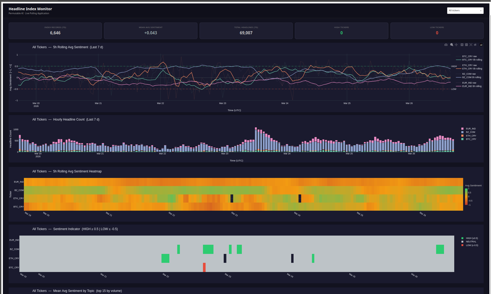
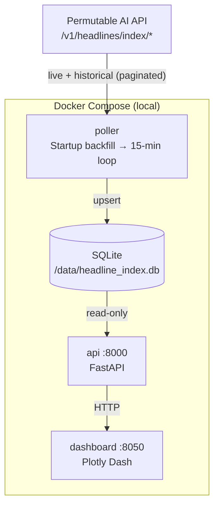

# Headline Index Live Polling Application

An example Python application that continuously polls the [Permutable AI](https://permutable.ai) pre-aggregated headline sentiment index API, stores results in a local database, and exposes the data through a FastAPI service and a Plotly Dash monitoring dashboard.

> **This is a reference example, not a production template.** It is intended to illustrate the integration pattern and give you a working starting point. You should review, adapt, and harden it — including storage, authentication, error handling, and deployment — before using it in any real environment.

This application demonstrates an extended version of the workflow in the companion notebook:
[`notebooks/live/index_sentiment_polling.ipynb`](../../notebooks/live/index_sentiment_polling.ipynb)

> **Disclaimer:** This application is provided for informational and research purposes only. Nothing in this application constitutes financial advice or a recommendation to buy, sell, or hold any asset. Sentiment data and indicators surfaced here reflect aggregated model outputs and should not be used as the sole basis for any investment decision.



---

## Architecture



**Three services, one shared volume:**

| Service     | Role                                                                         | Port |
|-------------|------------------------------------------------------------------------------|------|
| `poller`    | Backfills historical index data on startup, then polls live data every 15 min | —    |
| `api`       | FastAPI — serves index records and average sentiment indicators               | 8000 |
| `dashboard` | Plotly Dash — monitoring dashboard, auto-refreshes every 60 s                | 8050 |

### Headline Index vs Raw Feed

The index endpoint (`/v1/headlines/index/ticker/live/{ticker}`) returns sentiment
that has already been aggregated into **hourly buckets** by the Permutable AI platform,
making it ready to consume directly without client-side aggregation.

| | Raw Feed (`live_headline_polling`) | Index (`live_index_polling`) |
|---|---|---|
| **Granularity** | One row per headline | One row per (ticker, hour, topic) |
| **Key fields** | `sentiment_score` per headline | `sentiment_sum`, `sentiment_abs_sum`, `headline_count`, `sentiment_std` |
| **Client aggregation** | Required | None — data is pre-aggregated |
| **Best for** | NLP features, custom aggregations | Monitoring dashboards, downstream integration |

---

## Prerequisites

- [Docker](https://docs.docker.com/get-docker/) ≥ 24
- [Docker Compose](https://docs.docker.com/compose/) ≥ 2.20 (bundled with Docker Desktop)
- A [Permutable AI](https://permutable.ai) API key

---

## Quickstart

```bash
# 1. Clone and navigate to the app directory
git clone https://github.com/permutable-ai/permutable-examples.git
cd permutable-examples/systematic/headline_asset_sentiment/app/live_index_polling

# 2. Create your .env file
cp .env.example .env

# 3. Edit .env — set your API key and tickers
#    API_KEY=<your-permutable-ai-api-key>
#    TICKERS=BTC_CRY,ETH_CRY,BZ_COM,EUR_IND
nano .env  # or your preferred editor

# 4. Build and start all services
docker compose up --build

# The poller will backfill the last 7 days of index data before the live loop begins.
# Open the dashboard once you see "Backfill complete." in the logs.
```

**Dashboard:** [http://localhost:8050](http://localhost:8050)
**API docs (Swagger UI):** [http://localhost:8000/docs](http://localhost:8000/docs)

To run in the background:

```bash
docker compose up --build -d
docker compose logs -f  # tail logs
```

To stop:

```bash
docker compose down         # stop + remove containers
docker compose down -v      # also remove the database volume
```

---

## Configuration Reference

All configuration is managed through environment variables in `.env`. Every service reads from the same file.

| Variable                 | Default                                 | Description                                          |
|--------------------------|-----------------------------------------|------------------------------------------------------|
| `API_KEY`                | *(required)*                            | Your Permutable AI API key                           |
| `BASE_URL`               | `https://copilot-api.permutable.ai/v1` | Permutable AI base URL                               |
| `TICKERS`                | `BTC_CRY,ETH_CRY,BZ_COM,EUR_IND`      | Comma-separated tickers to monitor                   |
| `INDEX_TYPE`             | `COMBINED`                              | `EXPLICIT`, `IMPLICIT`, or `COMBINED`                |
| `TOPIC_PRESET`           | `ALL`                                   | Topic preset name or `ALL`                           |
| `SPARSE`                 | `true`                                  | Only return buckets that contain headlines           |
| `ALIGN_TO_PERIOD_END`    | `true`                                  | Timestamp each bucket at the close of the hour       |
| `POLL_INTERVAL_SECONDS`  | `900`                                   | Seconds between live polls (default = 15 min)        |
| `BACKFILL_DAYS`          | `7`                                     | Days of history to fetch on startup                  |
| `DB_PATH`                | `/data/headline_index.db`               | SQLite file path inside containers                   |
| `UPPER_THRESHOLD`        | `0.5`                                   | Average sentiment above this → HIGH indicator        |
| `LOWER_THRESHOLD`        | `-0.5`                                  | Average sentiment below this → LOW indicator         |
| `API_URL`                | `http://api:8000`                       | Dashboard → API address (use container service name) |
| `REFRESH_INTERVAL_MS`    | `60000`                                 | Dashboard auto-refresh interval in milliseconds      |

> **Tip:** To change the poll interval, update `POLL_INTERVAL_SECONDS` and restart with `docker compose up -d --build`.

---

## Services

### Poller

The poller is the only service that writes to the database. On startup it:

1. Creates the `headline_index` table if it does not exist.
2. Checks the latest stored record per ticker — if data already exists it resumes from that date, otherwise runs a **full historical backfill** (paginated, keyset pagination, up to 90-day lookback).
3. Enters an infinite loop — polls all tickers every `POLL_INTERVAL_SECONDS` seconds using the live index endpoint.

The live endpoint always returns the most recent 2-hour window of hourly buckets. Because both the historical and live endpoints write via `INSERT OR REPLACE` into the same table, data is automatically de-duplicated across the backfill and live polls.

### API

FastAPI application. Read-only access to the database — the poller is the sole writer.

| Method | Path                    | Description                                                                 |
|--------|-------------------------|-----------------------------------------------------------------------------|
| `GET`  | `/health`               | Service status and database row count                                       |
| `GET`  | `/index`                | Raw index records; params: `ticker`, `hours` (default 24), `limit`         |
| `GET`  | `/sentiment/latest`     | Latest average sentiment indicator per ticker (HIGH / NEUTRAL / LOW)       |
| `GET`  | `/sentiment/history`    | Full hourly average sentiment time series; params: `ticker`, `hours` (default 168) |

Swagger UI is available at [http://localhost:8000/docs](http://localhost:8000/docs).

### Average Sentiment

Average sentiment is the primary derived metric:

```
sentiment_avg = sentiment_sum / headline_count   ∈ [−1, +1]
```

- **+1** — all headlines in the bucket were strongly positive
- **−1** — all headlines in the bucket were strongly negative
- **≈ 0** — mixed sentiment regardless of volume

The API applies a **5-hour rolling mean** before thresholding. Indicators:

| Indicator | Condition |
|-----------|-----------|
| `HIGH`    | `sentiment_smooth ≥ UPPER_THRESHOLD` (default 0.5)  |
| `NEUTRAL` | Between thresholds                                   |
| `LOW`     | `sentiment_smooth ≤ LOWER_THRESHOLD` (default −0.5) |

### Dashboard

Plotly Dash monitoring dashboard that auto-refreshes every `REFRESH_INTERVAL_MS` milliseconds (default 60 s). All data is fetched from the API service.

A **ticker dropdown** in the header (defaulting to "All tickers") filters every chart simultaneously.

**Charts displayed:**

- **Stat cards** — total index records (7 d), mean average sentiment, total headlines, HIGH/LOW ticker counts
- **5h Rolling Avg Sentiment** — raw + smoothed line per ticker with threshold bands
- **Hourly Headline Count** — stacked bar chart showing news flow volume
- **Avg Sentiment Heatmap** — red → green heatmap across all hours, date ticks at day boundaries
- **Sentiment Indicator Heatmap** — HIGH / NEUTRAL / LOW colour blocks per hour and ticker
- **Mean Avg Sentiment by Topic** — horizontal bar chart (top 15 topics by headline volume)

---

## Example API Usage

```bash
# Health check
curl http://localhost:8000/health

# Last 2 hours of index data for BTC
curl "http://localhost:8000/index?ticker=BTC_CRY&hours=2"

# Latest average sentiment indicator for all tickers
curl http://localhost:8000/sentiment/latest

# 7-day average sentiment history for EUR_IND
curl "http://localhost:8000/sentiment/history?ticker=EUR_IND&hours=168"
```

---

## Extending the Application

**Adding tickers:** Update `TICKERS` in `.env` and restart. The poller will backfill new tickers on the next startup.

**Widening the backfill window:** Increase `BACKFILL_DAYS` (max 90 days supported by the API). Delete the database volume first if you want a clean backfill: `docker compose down -v && docker compose up`.

**Adjusting sentiment thresholds:** Update `UPPER_THRESHOLD` and `LOWER_THRESHOLD` in `.env`. Restart the API and dashboard services.

**Adding new API endpoints:** Edit `api/main.py` and add routes.

---

## Going Further

The sections below outline ways you might extend this example for your own use. They are reference starting points only — they are not hardened for production use and should be treated as illustrative rather than prescriptive.

### EC2 / Single VM

Copy the repository to a server and run the same `docker compose up -d` command.

```bash
git clone <repo>
cd live_index_polling
cp .env.example .env && nano .env
docker compose up -d --build
```

Configure a reverse proxy (nginx / Caddy) to expose the API and dashboard over HTTPS.

---

### AWS ECS + Fargate

**Push images to ECR:**

```bash
aws ecr create-repository --repository-name permutable-index-poller
aws ecr create-repository --repository-name permutable-index-api
aws ecr create-repository --repository-name permutable-index-dashboard

docker build -t permutable-index-poller ./poller
docker tag permutable-index-poller:latest <account>.dkr.ecr.<region>.amazonaws.com/permutable-index-poller:latest
# Repeat for api and dashboard, then push
```

**Poller as an ECS Scheduled Task** using EventBridge (`rate(15 minutes)`).
**API and Dashboard as ECS Services** behind an Application Load Balancer.
**Shared storage:** EFS volume at `/data` across all task definitions.

---

### Kubernetes (EKS / GKE)

**Poller as a CronJob:**

```yaml
apiVersion: batch/v1
kind: CronJob
metadata:
  name: index-poller
spec:
  schedule: "*/15 * * * *"
  jobTemplate:
    spec:
      template:
        spec:
          containers:
            - name: poller
              image: <registry>/permutable-index-poller:latest
              envFrom:
                - secretRef:
                    name: permutable-secrets
              volumeMounts:
                - name: db-data
                  mountPath: /data
          volumes:
            - name: db-data
              persistentVolumeClaim:
                claimName: index-db-pvc
```

---

### Airflow (If Already Running)

```python
from airflow import DAG
from airflow.operators.python import PythonOperator
from datetime import datetime, timedelta

with DAG(
    "headline_index_poller",
    schedule_interval="*/15 * * * *",
    start_date=datetime(2024, 1, 1),
    catchup=False,
    default_args={"retries": 2, "retry_delay": timedelta(minutes=1)},
) as dag:

    poll = PythonOperator(
        task_id="poll_all_tickers",
        python_callable=lambda: [
            upsert_index(fetch_live_index(t))
            for t in settings.tickers_list
        ],
    )
```

---

### Database Upgrade: SQLite → PostgreSQL

If you need a more durable store, only `db.py` in each service needs updating to switch backends.

Only `db.py` in each service needs updating. Replace `INSERT OR REPLACE` (SQLite) with:

```sql
-- PostgreSQL upsert
INSERT INTO headline_index (ticker, publication_time, topic_name, index_type, ...)
VALUES (%s, %s, %s, %s, ...)
ON CONFLICT (ticker, publication_time, topic_name, index_type)
DO UPDATE SET sentiment_sum = EXCLUDED.sentiment_sum, fetched_at = EXCLUDED.fetched_at;
```

---

## File Structure

```
live_index_polling/
├── docker-compose.yml        # Orchestrates all three services + shared volume
├── .env.example              # Environment variable template — copy to .env
├── README.md
│
├── poller/
│   ├── Dockerfile
│   ├── requirements.txt
│   ├── config.py             # Pydantic Settings — reads all vars from env
│   ├── db.py                 # SQLite setup: setup_database(), upsert_index()
│   ├── fetcher.py            # fetch_live_index(), fetch_historical_index()
│   ├── backfill.py           # backfill_all_tickers() — called once on startup
│   └── main.py               # Entrypoint: setup → backfill → polling loop
│
├── api/
│   ├── Dockerfile
│   ├── requirements.txt
│   ├── config.py
│   ├── db.py                 # Read-only SQLite connection
│   ├── models.py             # Pydantic response schemas
│   ├── signals.py            # compute_sentiment_avg() — rolling average sentiment
│   └── main.py               # FastAPI app
│
└── dashboard/
    ├── Dockerfile
    ├── requirements.txt
    ├── config.py
    └── app.py                # Dash monitoring dashboard
```

---

## Troubleshooting

**Dashboard shows "No data — poller starting up…"**
The poller runs the historical backfill before starting the live loop. Wait for the log line `Backfill complete.` — this can take a few minutes depending on the number of tickers and `BACKFILL_DAYS`.

**HTTP 422 from the Permutable API**
Check that your `TICKERS` values are valid ticker symbols included in your licence.

**SQLite database locked**
The poller is the sole writer. Ensure only one poller instance is running.

**Port conflicts**
If 8000 or 8050 are in use, change the host-side port mappings in `docker-compose.yml`:
```yaml
ports:
  - "9000:8000"  # host:container
```

---

## Licence

See the repository root for licence information.
