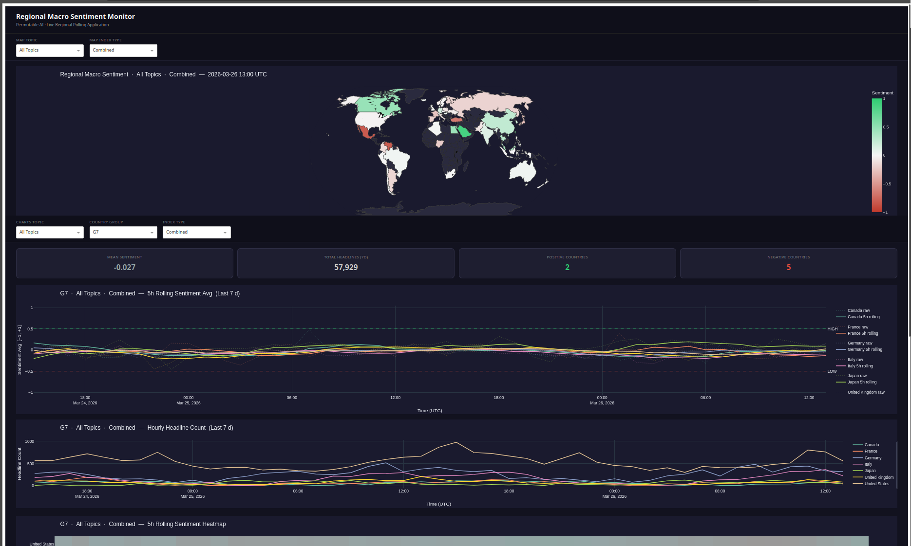

# Live Regional Macro Sentiment Polling Application

A production-ready example application that continuously polls the **Permutable AI Regional Macro Sentiment Index API** and displays an interactive monitoring dashboard with a live world map choropleth and per-country sentiment analysis.

> **Disclaimer:** This application is provided for informational and research purposes only. Nothing it produces constitutes financial advice or a recommendation to buy, sell, or hold any asset. Sentiment indicators derived here reflect aggregated model outputs and should not be used as the sole basis for any investment decision.



---

## Architecture

```
┌──────────────────────────────────────────────────────────────────────────┐
│                         Docker Compose                                   │
│                                                                          │
│  ┌──────────────┐    ┌──────────────────┐    ┌──────────────────────┐   │
│  │   poller     │    │      api         │    │     dashboard        │   │
│  │              │    │                  │    │                      │   │
│  │ Fetches live │    │ FastAPI service  │    │  Plotly Dash app     │   │
│  │ regional     │───►│ reads SQLite     │───►│  world map +         │   │
│  │ macro data   │    │ serves REST API  │    │  sentiment charts    │   │
│  │ every 15 min │    │ :8000            │    │  :8050               │   │
│  └──────┬───────┘    └──────────────────┘    └──────────────────────┘   │
│         │                                                                │
│         ▼                                                                │
│  ┌──────────────────────────────────────┐                               │
│  │  SQLite  /data/macro_regional.db     │                               │
│  │  table: macro_regional_sentiment     │                               │
│  └──────────────────────────────────────┘                               │
└──────────────────────────────────────────────────────────────────────────┘
```

### Services

| Service | Port | Description |
|---|---|---|
| `poller` | — | Fetches live regional macro data for all three index types (COMBINED, DOMESTIC, INTERNATIONAL) every 15 minutes; runs a per-type historical backfill on first startup |
| `api` | 8000 | FastAPI service reading from the shared SQLite database; exposes `/regional`, `/sentiment/latest`, `/sentiment/history` |
| `dashboard` | 8050 | Plotly Dash monitoring dashboard with world map, time series, heatmap, and topic charts |

---

## Quick Start

### 1. Prerequisites

- Docker and Docker Compose v2+
- A Permutable AI API key

### 2. Configure environment

```bash
cp .env.example .env
# Edit .env — set API_KEY and adjust COUNTRY_PRESET / MODEL_ID as needed
```

### 3. Start all services

```bash
docker compose up --build -d
```

### 4. Open the dashboard

Navigate to [http://localhost:8050](http://localhost:8050).

On first startup, the poller runs a historical backfill (`BACKFILL_DAYS`, default 7 days) **for each index type** (COMBINED, DOMESTIC, INTERNATIONAL) before entering the live polling loop. The dashboard is queryable immediately — it shows "waiting for poller" until the first data arrives (typically within 30–90 seconds).

---

## Configuration

All settings are read from the `.env` file, which is passed to all three services by Docker Compose. Copy `.env.example` to `.env` and edit the values.

| Variable | Default | Description |
|---|---|---|
| `API_KEY` | *(required)* | Permutable AI API key |
| `MODEL_ID` | `macro_1` | Regional macro model (`macro_1` / `macro_2` / `macro_3`) |
| `COUNTRY_PRESET` | `G20` | Countries to include (`G20`, `G7`, `ALL`, or a single country name) |
| `TOPIC_PRESET` | `ALL` | Macro topics to include (`ALL` or a specific topic name) |
| `SPARSE` | `true` | Return only hourly buckets that have headlines |
| `ALIGN_TO_PERIOD_END` | `true` | Timestamp each bucket at the close of the hour |
| `POLL_INTERVAL_SECONDS` | `900` | How often to poll (seconds); 900 = 15 minutes |
| `BACKFILL_DAYS` | `7` | Days of history to seed on first startup (max 90) |
| `DB_PATH` | `/data/macro_regional.db` | Path inside the container for the SQLite file |
| `UPPER_THRESHOLD` | `0.5` | `sentiment_avg` threshold for a country to be counted as Positive |
| `LOWER_THRESHOLD` | `-0.5` | `sentiment_avg` threshold for a country to be counted as Negative |
| `REFRESH_INTERVAL_MS` | `60000` | Dashboard auto-refresh interval in milliseconds |

> **Note:** `INDEX_TYPE` is no longer a configurable variable. The poller always fetches all three index types — `COMBINED`, `DOMESTIC`, and `INTERNATIONAL` — in every poll cycle. The dashboard lets you switch between them interactively.

---

## API Endpoints

The `api` service is available at `http://localhost:8000`. Interactive docs at [http://localhost:8000/docs](http://localhost:8000/docs).

| Method | Endpoint | Description |
|---|---|---|
| `GET` | `/health` | Service status and database row count |
| `GET` | `/regional` | Raw regional sentiment records (filterable by `country`, `hours`, `limit`) |
| `GET` | `/sentiment/latest` | Latest sentiment indicator per country |
| `GET` | `/sentiment/history` | Full hourly sentiment time series (filterable by `country`, `hours`) |

### Example requests

```bash
# Health check
curl http://localhost:8000/health

# Last 7 days of all regional data
curl "http://localhost:8000/regional?hours=168&limit=50000"

# Latest indicator for all countries
curl http://localhost:8000/sentiment/latest

# 7-day sentiment history for a specific country
curl "http://localhost:8000/sentiment/history?country=united%20states&hours=168"
```

---

## Sentiment Signal

The dashboard derives a smoothed signal from a 5-hour rolling mean of `sentiment_avg`:

```
sentiment_avg ∈ [−1, +1]
sentiment_smooth = rolling_mean(sentiment_avg, window=5h)

Positive country:  sentiment_smooth >  UPPER_THRESHOLD  (+0.5)
Negative country:  sentiment_smooth <  LOWER_THRESHOLD  (−0.5)
```

`sentiment_avg` is the primary signal from the regional macro index — it is already normalised across headlines in each hourly bucket, so no further scaling is required.

---

## Index Types

The poller fetches three independent views of the macro signal in every poll cycle:

| Index Type | Meaning |
|---|---|
| **COMBINED** | All news coverage — domestic and international sources combined |
| **DOMESTIC** | Only headlines published within the country being measured |
| **INTERNATIONAL** | Only headlines published outside the country being measured |

Each index type is stored under its own `index_type` key in the database and can be selected independently on both the world map and the charts via the dashboard filter bars.

---

## How the Regional Macro API Differs from the Asset Index

| | Asset Index | Regional Macro |
|---|---|---|
| **Endpoint** | `/headlines/index/ticker/live/{ticker}` | `/headlines/index/macro/live/regional/{model_id}` |
| **Primary dimension** | Ticker | Country |
| **Primary metric** | `sentiment_sum`, `sentiment_abs_sum` | `sentiment_avg` (normalised) |
| **Conviction/signal** | `conviction_ratio = sentiment_sum / sentiment_abs_sum` | `sentiment_avg` directly |
| **Index types** | Single type per call | COMBINED / DOMESTIC / INTERNATIONAL — all polled every cycle |
| **Loop** | Per-ticker API call | Single call covers all countries in preset |

---

## Dashboard Features

### Filters

Two filter bars sit above the charts. Filters on the map bar apply only to the world map; filters on the charts bar apply to everything below it.

| Filter | Location | Options |
|---|---|---|
| **Map Topic** | Map bar | All Topics, or any topic name present in the data |
| **Map Index Type** | Map bar | Combined / Domestic / International |
| **Charts Topic** | Charts bar | All Topics, or any topic name present in the data |
| **Country Group** | Charts bar | G7, G20, Europe, Asia, North America, South America, Africa, Middle East |
| **Index Type** | Charts bar | Combined / Domestic / International |

### Stat cards

| Card | Description |
|---|---|
| **Mean Sentiment** | 5h-smoothed mean across the latest snapshot of active countries |
| **Total Headlines (7d)** | Total headline count across the selected group and topic |
| **Positive Countries** | Countries where the latest smoothed sentiment > 0 |
| **Negative Countries** | Countries where the latest smoothed sentiment < 0 |

### Charts

| Chart | Description |
|---|---|
| **World map choropleth** | Most-recent `sentiment_avg` per country, filtered by map topic and index type |
| **5h Rolling Sentiment Avg** | Country time series — raw (dotted) and 5h rolling mean (solid) |
| **Hourly Headline Count** | Line chart of news flow per country over 7 days |
| **5h Rolling Sentiment Heatmap** | Country × hour heatmap; NaN gaps shown as grey (neutral) |
| **Mean Sentiment by Topic** | Horizontal bar chart of mean sentiment per macro topic (top 15 by volume) |

---

## Deployment Notes

### Persistent storage

The SQLite database is stored in a named Docker volume (`db_data`). It persists across `docker compose down` and `docker compose up` restarts. On restart the poller resumes from the latest stored record **per index type**, avoiding redundant API calls.

### Cloud deployment

For production deployments, consider replacing SQLite with a managed database (PostgreSQL, RDS, etc.) and running the poller as a scheduled task (e.g. AWS ECS, Cloud Run, Kubernetes CronJob). The `poller/fetcher.py` and `poller/db.py` files are the only files that need updating to switch database backends.

### Scaling

The `api` and `dashboard` services are stateless and can be scaled horizontally. The `poller` should run as a single instance to avoid duplicate writes.

---

## Related Resources

- [`notebooks/live/regional_macro_sentiment_polling.ipynb`](../../notebooks/live/regional_macro_sentiment_polling.ipynb) — interactive notebook covering the same polling workflow
- [`notebooks/backtesting/regional_cross_country_signal_assessment.ipynb`](../../notebooks/backtesting/regional_cross_country_signal_assessment.ipynb) — offline backtesting pipeline for historical regional sentiment
- [Permutable AI API Documentation](https://docs.permutable.ai)
